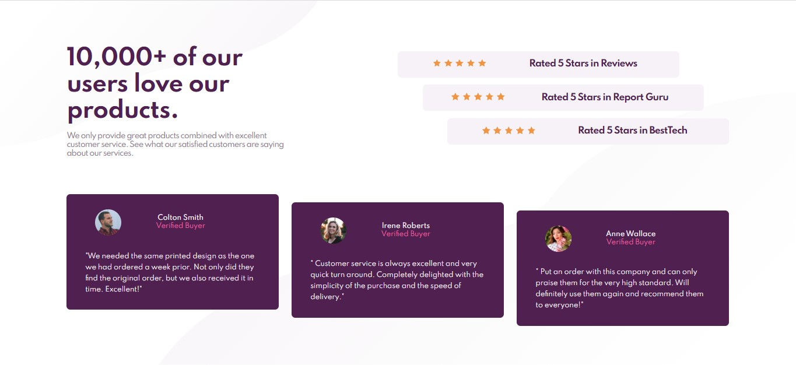
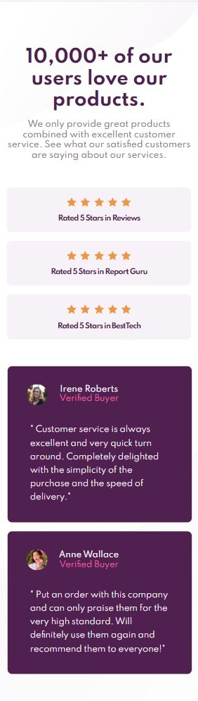

# Frontend Mentor - Seção de prova social

Esta é uma solução para o [desafio da seção de prova social](https://www.frontendmentor.io/challenges/social-proof-section-6e0qTv_bA). 
Os desafios do Frontend Mentor ajudam a melhorar as habilidades de desenvolvimento ao construir projetos reais.

## Índice
- [Descrição](#descrição)
  - [O desafio](#o-desafio)
  - [Screenshot](#screenshot)
  - [Links](#links)
- [Meu processo](#meu-processo)
  - [Ferramentas](#ferramentas)
  - [O que eu aprendi](#o-que-eu-aprendi)
  
## Descrição

### O desafio

- Elabore o projeto de acordo com os designs fornecidos

### Screenshot
Versão Web

Versão Mobile

### Links

- [Solução](#)
- [Github Page](#)

## Meu processo

### Ferramentas

- HTML5 semântico
- CSS
- Flexbox
- Grid
- Mobile-first 

### O que eu aprendi

Aprimorei minhas habilidades com CSS de modo geral, alguns exemplos são: 
- Redefinição dos estilos, através de alguns artigos da comunidade pude aprender a resetar a minha folha de estilos; 
- Aprendi um pouco sobre a propriedade background-position;
- Fiz uso do display grid combinando com o flex para chegar ao resultado final da versão web.